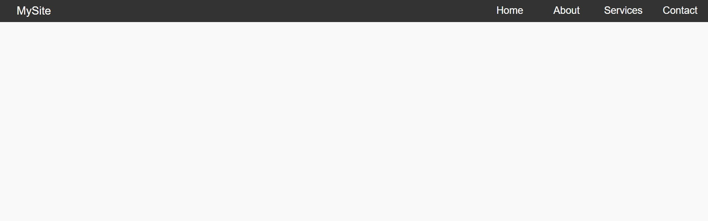
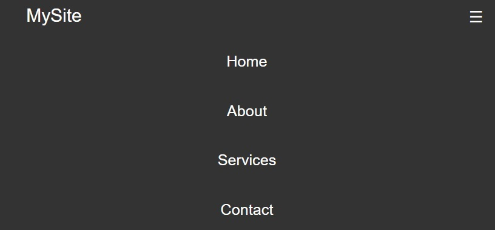

# Horizontal-menu-for-the-website

## Short description of project:
A simple horizontal menu that even a beginner in programming can easily create. The menu is flexible and adapted for mobile phones

## Demo
Desktop version

Mobile version

## Prerequisites
Before you begin, ensure you have met the following requirements:
- Git must be installed on your operating system.

## Installing
To install, follow these steps:

## Linux and macOS:
sudo git clone https://github.com/BatigAndriy/Horizontal-menu-for-the-website

## Windows:
git clone clone https://github.com/BatigAndriy/Horizontal-menu-for-the-website

## License
This project is free to use and does not contain any license.
